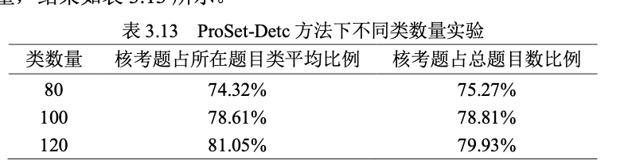

# parse_paper_to_parts
解析PDF格式的论文（解析成文本、图、表格）。

用法（Linux版调一下路径）：
```bash
git clone https://github.com/PolarisRisingWar/parse_paper_to_parts.git
cd parse_paper_to_parts\pptp
```
在pptp文件夹下新建.env中设置OpenAI_API_KEY和OpenAI_BASE_URL，新建llmlogs文件夹  
另外需要注意的是，如果想用tabula包，必须要安装Java
```bash
python convert_pdf.py -ip 需要解析的论文.pdf -op 文件夹
```
（文件夹可以不存在。注意文件夹里部分与生成后同名的文件会被覆盖掉，我没有关心具体哪些会被覆盖掉，我的建议是直接给一个空文件夹）

具体来说，希望实现如下功能：
1. 支持中英版论文，包括毕业论文、期刊会议论文、实验报告等格式。  
这个项目一开始是我们实验室让我做的，所以一开始只准备实现中文毕业论文格式的解析。但是我们导师不管这个项目了，所以我就自己开发了。  
非论文的文档应该也能实现类似的功能，但可能不太契合。
2. 输入完整的论文PDF，输出文本TXT，描述图片和表格的JSON文件，图片文件夹（每个图片都存储为PNG格式）
3. 输入文件名：{sample}.pdf
4. 文本TXT：{sample}_text.txt：① 保留目录，去除页眉页脚、引用文献和脚注的符号、图表内容（但不去除正文中对图标的描述内容） ② 公式解析为LaTeX格式，保留公式标识（如“公式2.1”） ③ 以Markdown格式保留各级标题（但不保留正文格式）④ 代码和伪代码保留
5. 描述图片的JSON：{sample}_pic.json：字典格式，键为图片ID（如“图1.1”），图片ID与图片文件夹下的文件名（不带.png后缀）和正文中的图片id对应；值为图片的描述，如“图1.1 该图描述了…” 与原始PDF中的一致
6. 图片文件夹：{sample}_pic
7. 描述图片的JSON：{sample}_table.json：字典格式，键为表格ID（如“表1.1”），和正文中的表格id对应；值是表示表格内容的字典，格式如下：

```json
{
	“description”: “表3.13 Pro…”,
	“value”: [ [“类数量”，“核考题占所在题目类平均比例”，“核考题占总题目数比例”]， [“80”,”74.32%”,”75.27%”]，…]
}
```

实际已实现：
v-0.0.4: 
1. 仅实现部分可编辑的中文毕业论文解析
2. 使用ChatGPT获取标题、图片描述的功能；解决了子图无法处理的问题
2. 缺点：①子图暂时只能处理子图上下分布的情况，左右分布的暂时无法处理；还没有处理子图命名问题 ②暂时仅考虑文本可编辑的情况，且仅在一篇论文上测试实现。不可编辑的PDF（扫描件）应该必须要用OCR实现了 ③有一些公式和表格无法通过PyMuPDF或者tabula-py提取，我猜应该还是需要用目标检测方法实现提取（我用的PyMuPDF无法解析特殊字符，包括①②这种。有一些格式的论文PDF的公式可以解析为文本，但是只能复制而不是直接以LaTeX公式形式呈现所以……）  ④关于页眉页脚和页码的去除，应该需要针对每篇PDF计算其正文的box位置范围 ⑤使用AI的部分可能会出现无法预知的错误（有些可以预知的已经在处理了，不可预知的等我以后自己train个模型吧，理论上更专业的模型会更稳定些） ⑤有一些换行的捕获有问题，这是因为pymupdf无法捕获段前空格，我下次用block位置来解析这点，现在这版大家先凑合用吧。⑥ tabula会报Invalid ToUnicode CMap in font和Using predefined identity CMap instead错误。我懒得处理了以后再说吧
2. 下个版本的更新计划：实现OCR（我实验室安装好tesseract的服务器炸了）；试用提取公式功能
	1. Doc2X的免费API（我试了一下感觉十分牛逼，准备尝试把一堆公式放在一张PDF里一起试）因为免费版一个人一天只有500页的额度，要是全塞进去，这不是没几篇毕业论文就霍霍没了吗？  
	Doc2X识别整个框架的技术都很牛逼，但是又还是有一点不足。整体上就想抄代码……
	2. Aspose和mathpix的API
	3. ScanSSD <https://ws-dl.blogspot.com/2020/06/2020-06-05-math-formula-extraction-from.html> 提取公式
	4. https://github.com/facebookresearch/nougat
	5. https://github.com/opengovsg/pdf2md
	6. https://github.com/run-llama/llama_parse  
	https://docs.llamaindex.ai/en/stable/llama_cloud/llama_parse/
	4. 其实我也有考虑自己train一个模型
	8. 多模态LLM，比如：[openbmb/MiniCPM-Llama3-V-2_5 · Hugging Face](https://huggingface.co/openbmb/MiniCPM-Llama3-V-2_5)

测试效果见examples文件夹：
- example1：2024.5.23 13:59-14:02
- example2：2024.5.23 13:45-13:49

参考资料：
1. <https://github.com/Alihassan7212/PDF-extraction-and-dissection/blob/main/project.py>
